# 🍔 Burger App (Flutter)

A modern food ordering application built with **Flutter** that allows users to browse burgers, add them to cart, place orders, and manage their profile.

This project demonstrates building a real-world mobile application with authentication, state management, API integration, and clean UI.

---

## 🚀 Features

* 🔐 User Authentication (Sign Up & Login)
* 🔄 Auto Login using stored token
* 🍔 Browse products with categories
* 🔍 Search for products
* 📄 Product Details screen
* 🛒 Add products to cart
* ➕ Increase / Decrease product quantity
* ❌ Remove products from cart
* 💳 Checkout and place orders
* 📦 Order History with Reorder feature
* 👤 User Profile
* 🖼 Upload profile image from gallery
* ✏ Edit user information
* 🚪 Sign out
* ⚡ Smooth animations

---

## 📱 Screens

* Splash Screen
* Login
* Sign Up
* Home (Products + Categories)
* Product Details
* Cart
* Checkout
* Order History
* Profile

---

## 🛠 Tech Stack

* Flutter
* Dart
* REST API
* Bloc / Cubit (State Management)
* Clean Architecture
* HTTP Networking

---

## 📸 Screenshots

### 🟢 Splash & Authentication
| Animated Splash | Splash Screen |
| :---: | :---: |
| 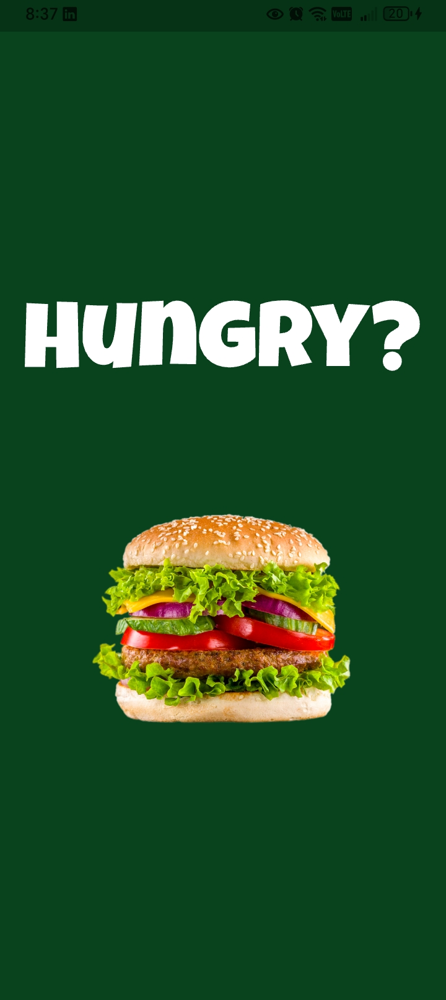 |  |

| Login View | Sign Up View |
| :---: | :---: |
| 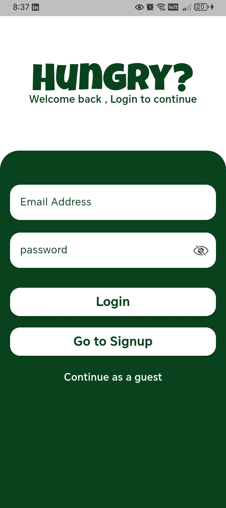 | 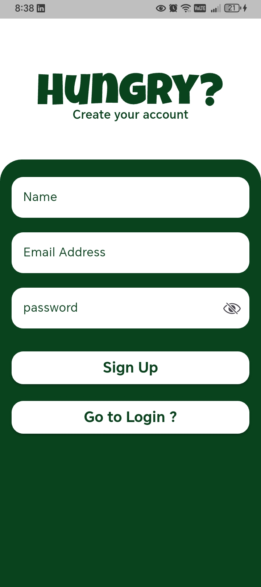 |

---

### 🍔 Main App & Categories
| Home View | Search View |
| :---: | :---: |
| 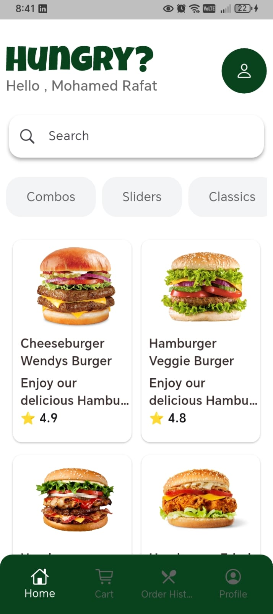 | 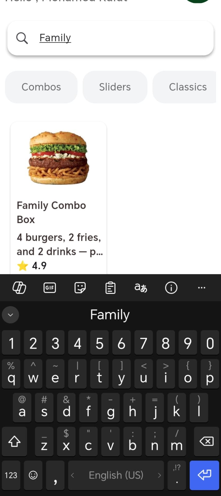 |

| Classic Category | Slider Category |
| :---: | :---: |
| 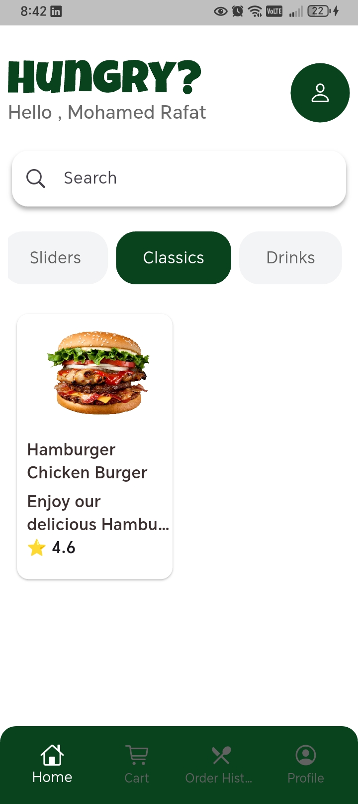 | 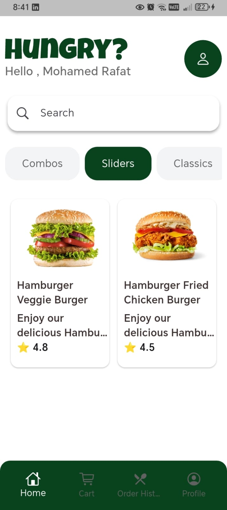 |

---

### 🛒 Product Details & Cart
| Product Details 1 | Product Details 2 |
| :---: | :---: |
| 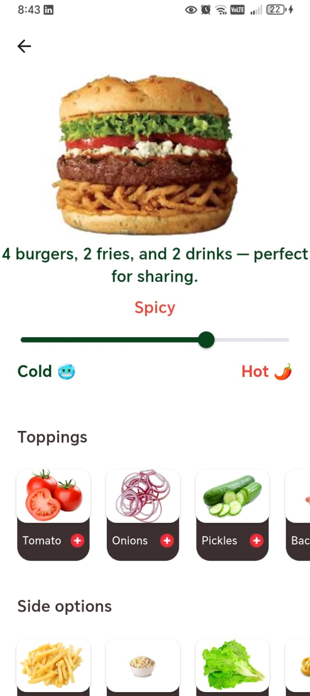 | 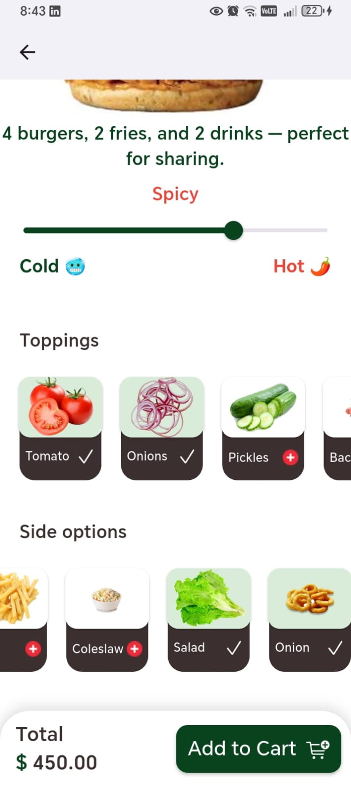 |

| Cart | Order Summary |
| :---: | :---: |
| 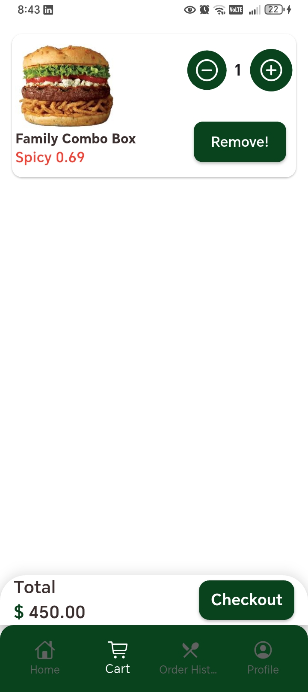 | 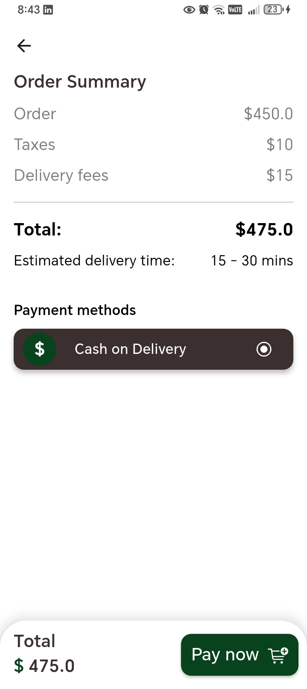 |

---

### 👤 Profile & Orders
| Profile View | Last Orders |
| :---: | :---: |
| 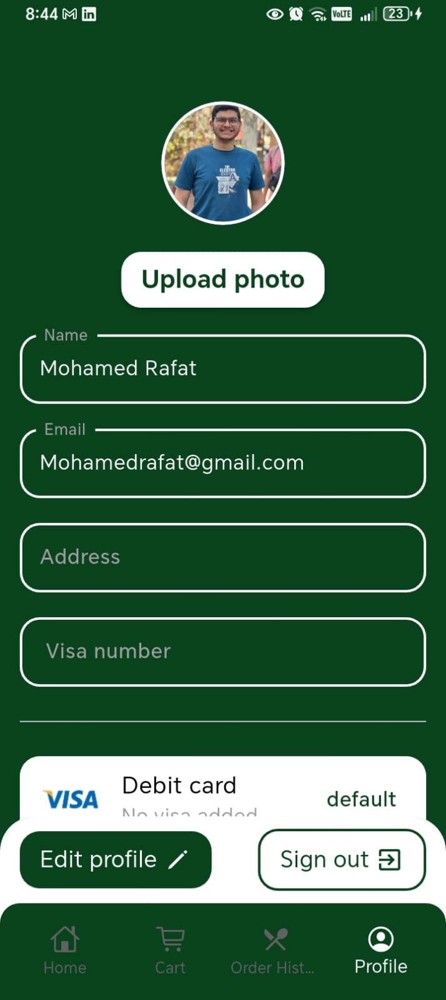 | 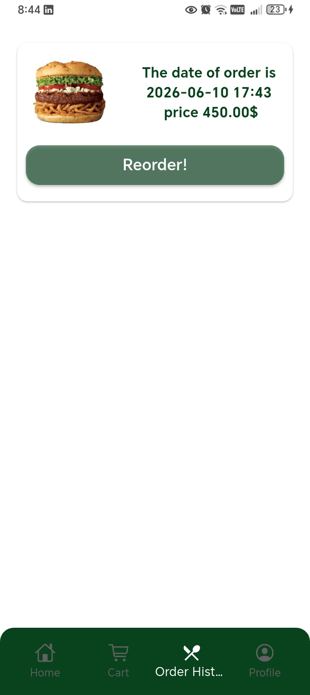 |


## 📂 Project Structure

```
lib
 ┣ core
 ┣ features
 ┃ ┣ auth
 ┃ ┣ home
 ┃ ┣ cart
 ┃ ┣ orders
 ┃ ┗ profile
 ┗ main.dart
```

---

## 🎯 Purpose of this project

This project was developed as a **portfolio project** to demonstrate Flutter development skills including:

* State management
* API integration
* UI/UX development
* Application architecture

---

## 👨‍💻 Author

Mohamed Rafat
Flutter Developer

